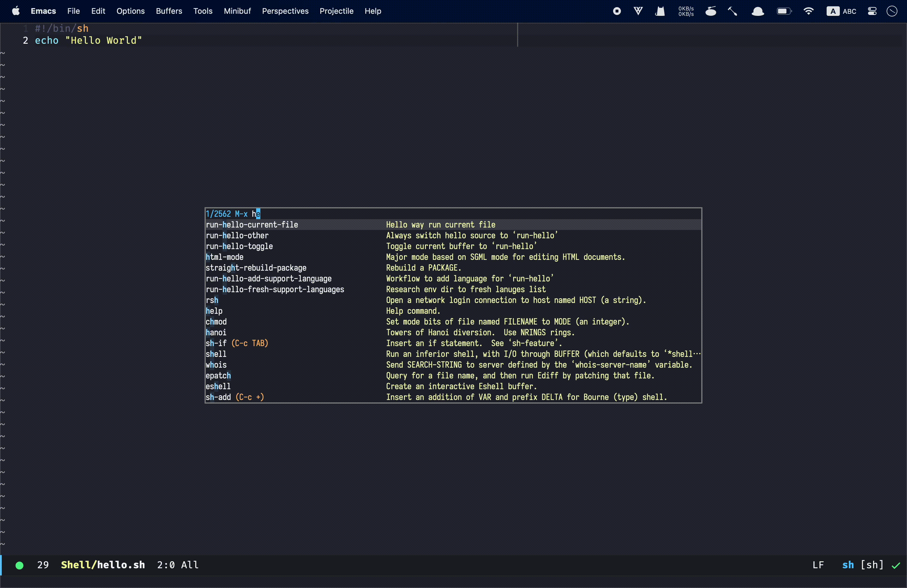

# Run Hello World
Run [Hello World](https://github.com/ingtshan/hello-world) in your Emacs with a [output buffer](https://github.com/ingtshan/run-hello-world.el/blob/main/output-buffer.el) provided.



## Run from supported language list

`M-x run-hello-toggle` 

Interactively selecting a supporting language, first time it will pull the hello-word code file to your workspace, then run.

`M-x run-hello-other` 

Run a supporting language (different from current buffer) 

`M-x run-hello-current-file`

Run current file using this "hello-world way" (such as shell file) 

## Installation 
Git clone it to your configuration folder say "~/.emacs.d/elisp/run-hello-world"
``` shell
cd ~/.emacs.d/elisp
git clone git@github.com:ingtshan/run-hello-world.el.git run-hello-world
```

Add it to your initial file
``` emacs-lisp
(add-to-list 'load-path "~/.emacs.d/elisp/run-hello-world")
(require 'run-hello-world)
```

You can change workspace by
``` emacs-lisp
(setq run-hello-workspace "~/projects/hello-world.d")
```

## Add supported language

With further experiencing, you will find out this package uses a simple way to form a shell command that run the single hello-world source file base on the env JSON at [env/languages](https://github.com/ingtshan/run-hello-world.el/tree/main/env/languages)

`M-x run-hello-add-support-language` 

To quick generat a new env JSON or modify existing env JSON

## Too many languages don't need?

If so, you can custom env JSON directory to exclude languages you don't need (copy env-dir and modify), by
``` emacs-lisp
(setq run-hello-env-dir "~/run-hello-workspace/env")
```
# Reference
- [hello-world](https://github.com/leachim6/hello-world)
- [help-mode.el](https://github.com/emacs-mirror/emacs/blob/master/lisp/help-mode.el)
- [compile.el](https://github.com/emacs-mirror/emacs/blob/master/lisp/progmodes/compile.el)
